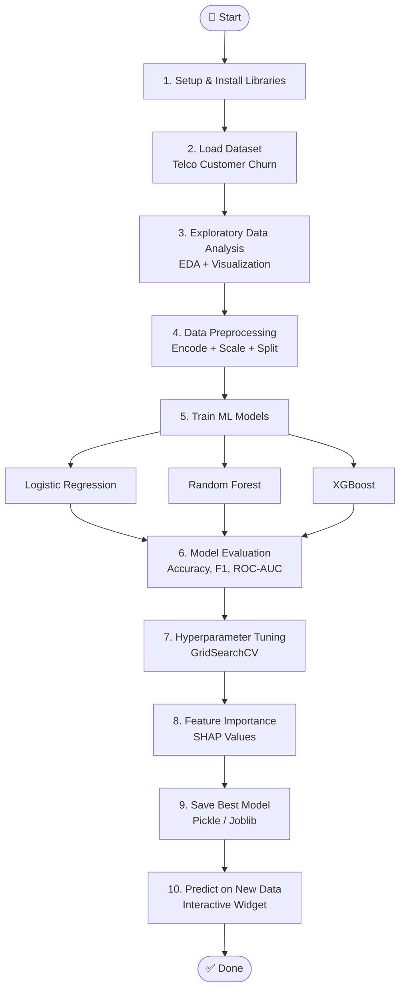
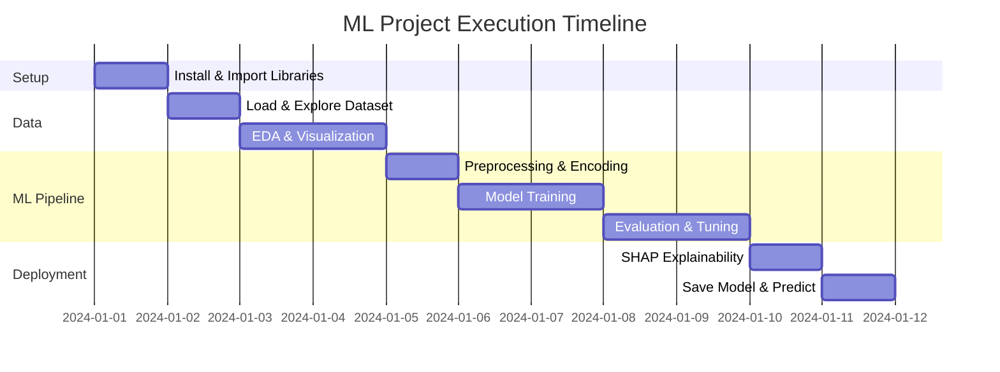
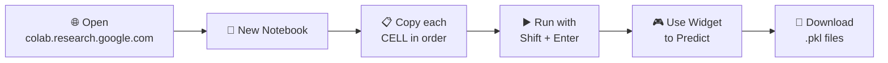

# predicting-the-customer-will-leave-or-stay-
A customer prediction project in AI/ML is about identifying which customers are likely to stop using a product or service—so businesses can act before losing them.
<div class="reasoning-block-marker">

The user wants an AI/ML project idea with execution plan and code using Google Colab. Let me provide a comprehensive, practical project that's interesting and educational.

I'll go with a **Customer Churn Prediction** project - it's practical, uses real ML concepts, and is beginner-to-intermediate friendly.

Let me structure this well with:
1. Project idea and overview
2. Architecture/flow diagram
3. Step-by-step execution plan
4. Complete Google Colab code

Let me make this comprehensive and detailed.

</div>

# 🤖 AI/ML Project: Customer Churn Prediction System

---

## 📌 Project Overview

**Goal:** Predict whether a customer will leave (churn) a telecom company using Machine Learning — with full EDA, model training, evaluation, and a prediction interface.

---

## 🗺️ Project Flow



---

## 📋 Execution Plan



### optional  📊 CELL 13 — Final Summary Report

```python
# ============================================================
# CELL 13: Final Project Summary Report
# ============================================================

print("""
╔══════════════════════════════════════════════════════════╗
║         🎯 PROJECT SUMMARY REPORT                        ║
╠══════════════════════════════════════════════════════════╣
║  Project    : Customer Churn Prediction                  ║
║  Dataset    : Telco Customer Churn (~7000 records)       ║
║  Problem    : Binary Classification                      ║
╠══════════════════════════════════════════════════════════╣
║  📊 DATA PREPROCESSING                                   ║
║  ├─ Missing values handled: ✅                           ║
║  ├─ Label & One-Hot Encoding: ✅                         ║
║  ├─ Feature Engineering: ✅                              ║
║  └─ SMOTE Balancing: ✅                                  ║
╠══════════════════════════════════════════════════════════╣
║  🤖 MODELS TRAINED                                       ║
║  ├─ Logistic Regression                                  ║
║  ├─ Random Forest                                        ║
║  ├─ XGBoost                                              ║
║  └─ Gradient Boosting                                    ║
╠══════════════════════════════════════════════════════════╣
║  📈 BEST MODEL PERFORMANCE                               ║""")

print(f"║  ├─ Model:    {best_model_name:<42}║")
print(f"║  ├─ Accuracy: {best_result['accuracy']:.4f}                                     ║")
print(f"║  ├─ F1-Score: {best_result['f1_score']:.4f}                                     ║")
print(f"║  └─ ROC-AUC:  {best_result['roc_auc']:.4f}                                     ║")

print("""╠══════════════════════════════════════════════════════════╣
║  🔬 EXPLAINABILITY : SHAP Values ✅                      ║
║  💾 MODEL SAVED    : churn_model.pkl ✅                  ║
║  🎮 INTERACTIVE UI : ipywidgets ✅                       ║
╠══════════════════════════════════════════════════════════╣
║  📁 OUTPUT FILES                                         ║
║  ├─ eda_dashboard.png                                    ║
║  ├─ model_evaluation.png                                 ║
║  ├─ shap_importance.png                                  ║
║  ├─ shap_beeswarm.png                                    ║
║  ├─ churn_model.pkl                                      ║
║  └─ scaler.pkl                                           ║
╚══════════════════════════════════════════════════════════╝
""")
```

---

## 🚀 How to Run in Google Colab



| Step | Action |
|------|--------|
| 1️⃣ | Go to [colab.research.google.com](https://colab.research.google.com) |
| 2️⃣ | Create a **New Notebook** |
| 3️⃣ | Copy each CELL (1→13) into separate cells |
| 4️⃣ | Click **Runtime → Run All** or `Shift+Enter` per cell |
| 5️⃣ | Use the **interactive widget** to test predictions |
| 6️⃣ | Download `churn_model.pkl` for deployment |

---

## 🧠 Key Concepts Covered

| Concept | Implementation |
|---------|---------------|
| 📊 EDA | Seaborn + Matplotlib Dashboards |
| ⚖️ Imbalanced Data | SMOTE Oversampling |
| 🔧 Preprocessing | Label Encoding, One-Hot, Scaling |
| 🤖 Models | LR, RF, XGBoost, GBM |
| 📈 Evaluation | Accuracy, F1, ROC-AUC, Confusion Matrix |
| 🔍 Explainability | SHAP Values |
| 💾 Deployment | Joblib + ipywidgets UI |

> 💡 **Tip:** To extend this project, try deploying the model using **Streamlit** or **FastAPI** after building it in Colab!
