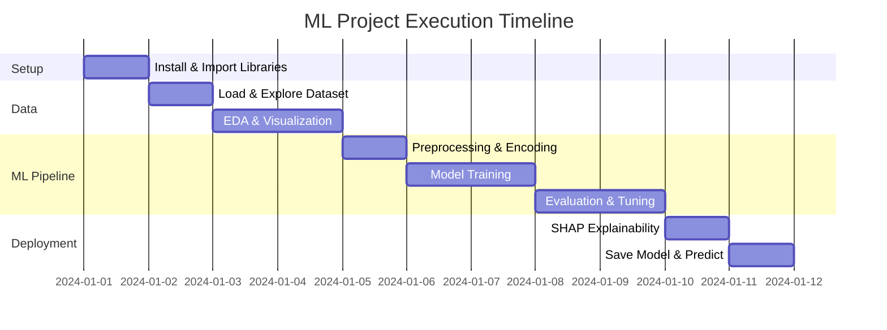
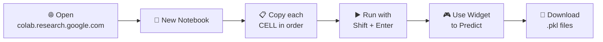

# predicting-the-customer-will-leave-or-stay-
A customer prediction project in AI/ML is about identifying which customers are likely to stop using a product or service—so businesses can act before losing them.
<div class="reasoning-block-marker">

The user wants an AI/ML project idea with execution plan and code using Google Colab. Let me provide a comprehensive, practical project that's interesting and educational.

I'll go with a **Customer Churn Prediction** project - it's practical, uses real ML concepts, and is beginner-to-intermediate friendly.

Let me structure this well with:
1. Project idea and overview
2. Architecture/flow diagram
3. Step-by-step execution plan
4. Complete Google Colab code

Let me make this comprehensive and detailed.

</div>

# 🤖 AI/ML Project: Customer Churn Prediction System

---

## 📌 Project Overview

**Goal:** Predict whether a customer will leave (churn) a telecom company using Machine Learning — with full EDA, model training, evaluation, and a prediction interface.

---

## 🗺️ Project Flow


---

## 📋 Execution Plan



---

## 💻 Complete Google Colab Code

### 📦 CELL 1 — Install Libraries

```python
# ============================================================
# CELL 1: Install Required Libraries
# ============================================================
!pip install xgboost shap imbalanced-learn --quiet

print("✅ Libraries installed successfully!")
```

---

### 📚 CELL 2 — Import Libraries

```python
# ============================================================
# CELL 2: Import All Libraries
# ============================================================
import numpy as np
import pandas as pd
import matplotlib.pyplot as plt
import seaborn as sns
import warnings
warnings.filterwarnings('ignore')

# ML Libraries
from sklearn.model_selection import train_test_split, GridSearchCV, cross_val_score
from sklearn.preprocessing import LabelEncoder, StandardScaler
from sklearn.linear_model import LogisticRegression
from sklearn.ensemble import RandomForestClassifier, GradientBoostingClassifier
from sklearn.metrics import (accuracy_score, classification_report,
                              confusion_matrix, roc_auc_score, roc_curve,
                              f1_score, precision_score, recall_score)
from imblearn.over_sampling import SMOTE
from xgboost import XGBClassifier
import shap
import joblib
import ipywidgets as widgets
from IPython.display import display, HTML

# Style
plt.style.use('seaborn-v0_8-darkgrid')
sns.set_palette("husl")
print("✅ All libraries imported!")
```

---

### 📂 CELL 3 — Load Dataset

```python
# ============================================================
# CELL 3: Load Dataset (Telco Customer Churn)
# ============================================================
# Download from URL directly
url = "https://raw.githubusercontent.com/dsrscientist/dataset1/master/telco_customer_churn.csv"

try:
    df = pd.read_csv(url)
    print("✅ Dataset loaded from URL!")
except:
    # Fallback: Generate synthetic dataset
    print("⚠️ URL failed — generating synthetic dataset...")
    
    np.random.seed(42)
    n = 7043
    
    df = pd.DataFrame({
        'customerID': [f'ID-{i:05d}' for i in range(n)],
        'gender': np.random.choice(['Male', 'Female'], n),
        'SeniorCitizen': np.random.choice([0, 1], n, p=[0.84, 0.16]),
        'Partner': np.random.choice(['Yes', 'No'], n),
        'Dependents': np.random.choice(['Yes', 'No'], n, p=[0.7, 0.3]),
        'tenure': np.random.randint(0, 72, n),
        'PhoneService': np.random.choice(['Yes', 'No'], n, p=[0.9, 0.1]),
        'MultipleLines': np.random.choice(['Yes', 'No', 'No phone service'], n),
        'InternetService': np.random.choice(['DSL', 'Fiber optic', 'No'], n, p=[0.34, 0.44, 0.22]),
        'OnlineSecurity': np.random.choice(['Yes', 'No', 'No internet service'], n),
        'TechSupport': np.random.choice(['Yes', 'No', 'No internet service'], n),
        'Contract': np.random.choice(['Month-to-month', 'One year', 'Two year'], n, p=[0.55, 0.21, 0.24]),
        'PaperlessBilling': np.random.choice(['Yes', 'No'], n, p=[0.59, 0.41]),
        'PaymentMethod': np.random.choice(
            ['Electronic check', 'Mailed check', 'Bank transfer (automatic)', 'Credit card (automatic)'], n),
        'MonthlyCharges': np.round(np.random.uniform(18, 118, n), 2),
        'TotalCharges': np.round(np.random.uniform(18, 8500, n), 2),
        'Churn': np.random.choice(['Yes', 'No'], n, p=[0.265, 0.735])
    })
    print("✅ Synthetic dataset created!")

print(f"\n📊 Dataset Shape: {df.shape}")
print(f"📋 Columns: {list(df.columns)}")
df.head()
```

---

### 🔍 CELL 4 — EDA

```python
# ============================================================
# CELL 4: Exploratory Data Analysis (EDA)
# ============================================================

print("=" * 55)
print("📊 DATASET INFORMATION")
print("=" * 55)
print(df.info())

print("\n" + "=" * 55)
print("📈 STATISTICAL SUMMARY")
print("=" * 55)
display(df.describe())

print("\n" + "=" * 55)
print("❓ MISSING VALUES")
print("=" * 55)
missing = df.isnull().sum()
print(missing[missing > 0] if missing.sum() > 0 else "No missing values found ✅")

print("\n" + "=" * 55)
print("🎯 TARGET DISTRIBUTION")
print("=" * 55)
print(df['Churn'].value_counts())
print(f"\nChurn Rate: {df['Churn'].value_counts(normalize=True)['Yes']*100:.1f}%")
```

---

### 📊 CELL 5 — Visualizations

```python
# ============================================================
# CELL 5: Visualization Dashboard
# ============================================================

fig, axes = plt.subplots(3, 3, figsize=(18, 15))
fig.suptitle('📊 Customer Churn - EDA Dashboard', fontsize=20, fontweight='bold', y=1.02)

# 1. Churn Distribution (Pie)
churn_counts = df['Churn'].value_counts()
colors = ['#2ecc71', '#e74c3c']
axes[0, 0].pie(churn_counts, labels=churn_counts.index, autopct='%1.1f%%',
               colors=colors, startangle=90, shadow=True)
axes[0, 0].set_title('🎯 Churn Distribution', fontsize=13, fontweight='bold')

# 2. Churn by Gender
gender_churn = pd.crosstab(df['gender'], df['Churn'], normalize='index') * 100
gender_churn.plot(kind='bar', ax=axes[0, 1], color=['#2ecc71', '#e74c3c'],
                  edgecolor='black', rot=0)
axes[0, 1].set_title('👥 Churn by Gender (%)', fontsize=13, fontweight='bold')
axes[0, 1].set_ylabel('Percentage')
axes[0, 1].legend(['No Churn', 'Churn'])

# 3. Churn by Contract Type
contract_churn = pd.crosstab(df['Contract'], df['Churn'], normalize='index') * 100
contract_churn.plot(kind='bar', ax=axes[0, 2], color=['#3498db', '#e74c3c'],
                    edgecolor='black', rot=15)
axes[0, 2].set_title('📄 Churn by Contract (%)', fontsize=13, fontweight='bold')
axes[0, 2].set_ylabel('Percentage')

# 4. Tenure Distribution
df.groupby('Churn')['tenure'].plot(kind='hist', ax=axes[1, 0],
                                    alpha=0.7, bins=30, color=['#2ecc71', '#e74c3c'])
axes[1, 0].set_title('📅 Tenure Distribution', fontsize=13, fontweight='bold')
axes[1, 0].set_xlabel('Tenure (months)')
axes[1, 0].legend(['No Churn', 'Churn'])

# 5. Monthly Charges vs Churn
df.boxplot(column='MonthlyCharges', by='Churn', ax=axes[1, 1],
           patch_artist=True,
           boxprops=dict(facecolor='lightblue'),
           medianprops=dict(color='red', linewidth=2))
axes[1, 1].set_title('💰 Monthly Charges by Churn', fontsize=13, fontweight='bold')
axes[1, 1].set_xlabel('Churn')
plt.sca(axes[1, 1])
plt.title('💰 Monthly Charges by Churn')

# 6. Internet Service Distribution
internet_churn = pd.crosstab(df['InternetService'], df['Churn'])
internet_churn.plot(kind='bar', ax=axes[1, 2], color=['#27ae60', '#c0392b'],
                    edgecolor='black', rot=15)
axes[1, 2].set_title('🌐 Internet Service vs Churn', fontsize=13, fontweight='bold')

# 7. Correlation Heatmap (numeric only)
numeric_df = df.select_dtypes(include=[np.number])
corr_matrix = numeric_df.corr()
sns.heatmap(corr_matrix, annot=True, fmt='.2f', cmap='coolwarm',
            ax=axes[2, 0], linewidths=0.5, square=True)
axes[2, 0].set_title('🔥 Correlation Heatmap', fontsize=13, fontweight='bold')

# 8. Monthly Charges Histogram
df[df['Churn']=='No']['MonthlyCharges'].plot(kind='hist', ax=axes[2, 1],
                                             alpha=0.7, bins=30, color='#2ecc71', label='No Churn')
df[df['Churn']=='Yes']['MonthlyCharges'].plot(kind='hist', ax=axes[2, 1],
                                              alpha=0.7, bins=30, color='#e74c3c', label='Churn')
axes[2, 1].set_title('💳 Monthly Charges Distribution', fontsize=13, fontweight='bold')
axes[2, 1].legend()

# 9. Churn by Payment Method
payment_churn = pd.crosstab(df['PaymentMethod'], df['Churn'], normalize='index') * 100
payment_churn['Yes'].sort_values().plot(kind='barh', ax=axes[2, 2],
                                         color='#e74c3c', edgecolor='black')
axes[2, 2].set_title('💳 Churn Rate by Payment (%)', fontsize=13, fontweight='bold')
axes[2, 2].set_xlabel('Churn Rate (%)')

plt.tight_layout()
plt.savefig('eda_dashboard.png', bbox_inches='tight', dpi=150)
plt.show()
print("✅ EDA Dashboard saved!")
```

---

### ⚙️ CELL 6 — Preprocessing

```python
# ============================================================
# CELL 6: Data Preprocessing
# ============================================================

print("🔧 Starting Data Preprocessing...")

# 1. Drop irrelevant column
df_processed = df.drop('customerID', axis=1, errors='ignore').copy()

# 2. Fix TotalCharges (sometimes has spaces)
if df_processed['TotalCharges'].dtype == 'object':
    df_processed['TotalCharges'] = pd.to_numeric(
        df_processed['TotalCharges'], errors='coerce')
    df_processed['TotalCharges'].fillna(df_processed['TotalCharges'].median(), inplace=True)

# 3. Encode Target Variable
df_processed['Churn'] = df_processed['Churn'].map({'Yes': 1, 'No': 0})

# 4. Encode Binary Categorical Features
binary_cols = ['gender', 'Partner', 'Dependents', 'PhoneService', 'PaperlessBilling']
for col in binary_cols:
    if col in df_processed.columns:
        df_processed[col] = LabelEncoder().fit_transform(df_processed[col].astype(str))

# 5. One-Hot Encode Multi-Class Categorical Features
multi_cols = ['MultipleLines', 'InternetService', 'OnlineSecurity',
              'TechSupport', 'Contract', 'PaymentMethod']
multi_cols = [c for c in multi_cols if c in df_processed.columns]

df_processed = pd.get_dummies(df_processed, columns=multi_cols, drop_first=True)

# 6. Feature Engineering
df_processed['AvgMonthlyCharges'] = (
    df_processed['TotalCharges'] / (df_processed['tenure'] + 1))
df_processed['TenureGroup'] = pd.cut(df_processed['tenure'],
                                      bins=[0, 12, 24, 48, 72],
                                      labels=[0, 1, 2, 3])
df_processed['TenureGroup'] = df_processed['TenureGroup'].astype(float)

print(f"✅ Processed Shape: {df_processed.shape}")
print(f"✅ Features: {df_processed.shape[1] - 1}")

# 7. Split Features and Target
X = df_processed.drop('Churn', axis=1)
y = df_processed['Churn']

# 8. Handle Class Imbalance with SMOTE
print(f"\n⚖️  Before SMOTE: {y.value_counts().to_dict()}")
smote = SMOTE(random_state=42)
X_resampled, y_resampled = smote.fit_resample(X, y)
print(f"⚖️  After SMOTE:  {pd.Series(y_resampled).value_counts().to_dict()}")

# 9. Train-Test Split
X_train, X_test, y_train, y_test = train_test_split(
    X_resampled, y_resampled, test_size=0.2, random_state=42, stratify=y_resampled)

# 10. Feature Scaling
scaler = StandardScaler()
X_train_scaled = scaler.fit_transform(X_train)
X_test_scaled = scaler.transform(X_test)

# Convert back to DataFrame for SHAP
X_train_df = pd.DataFrame(X_train_scaled, columns=X.columns)
X_test_df = pd.DataFrame(X_test_scaled, columns=X.columns)

print(f"\n✅ Train size: {X_train.shape}")
print(f"✅ Test size:  {X_test.shape}")
print("✅ Preprocessing Complete!")
```

---

### 🤖 CELL 7 — Train Multiple Models

```python
# ============================================================
# CELL 7: Train Multiple ML Models
# ============================================================

print("🚀 Training Models...\n")
print("=" * 55)

models = {
    "Logistic Regression": LogisticRegression(max_iter=1000, random_state=42),
    "Random Forest":        RandomForestClassifier(n_estimators=100, random_state=42, n_jobs=-1),
    "XGBoost":              XGBClassifier(n_estimators=100, random_state=42,
                                          use_label_encoder=False, eval_metric='logloss'),
    "Gradient Boosting":    GradientBoostingClassifier(n_estimators=100, random_state=42)
}

results = {}

for name, model in models.items():
    print(f"⏳ Training: {name}...")
    
    # Train
    model.fit(X_train_scaled, y_train)
    
    # Predict
    y_pred = model.predict(X_test_scaled)
    y_prob = model.predict_proba(X_test_scaled)[:, 1]
    
    # Metrics
    acc    = accuracy_score(y_test, y_pred)
    f1     = f1_score(y_test, y_pred)
    auc    = roc_auc_score(y_test, y_prob)
    prec   = precision_score(y_test, y_pred)
    rec    = recall_score(y_test, y_pred)
    
    results[name] = {
        'model': model,
        'accuracy': acc,
        'f1_score': f1,
        'roc_auc': auc,
        'precision': prec,
        'recall': rec,
        'y_pred': y_pred,
        'y_prob': y_prob
    }
    
    print(f"   ✅ Accuracy: {acc:.4f} | F1: {f1:.4f} | AUC: {auc:.4f}\n")

print("=" * 55)
print("🏆 MODEL COMPARISON")
print("=" * 55)

comparison_df = pd.DataFrame({
    name: {
        'Accuracy':  f"{r['accuracy']:.4f}",
        'F1-Score':  f"{r['f1_score']:.4f}",
        'ROC-AUC':   f"{r['roc_auc']:.4f}",
        'Precision': f"{r['precision']:.4f}",
        'Recall':    f"{r['recall']:.4f}"
    }
    for name, r in results.items()
}).T

display(comparison_df)
```

---

### 📈 CELL 8 — Model Evaluation Plots

```python
# ============================================================
# CELL 8: Model Evaluation Visualizations
# ============================================================

fig, axes = plt.subplots(2, 2, figsize=(16, 14))
fig.suptitle('📈 Model Evaluation Dashboard', fontsize=18, fontweight='bold')

colors = ['#3498db', '#2ecc71', '#e74c3c', '#f39c12']

# 1. ROC Curves
ax = axes[0, 0]
for (name, r), color in zip(results.items(), colors):
    fpr, tpr, _ = roc_curve(y_test, r['y_prob'])
    ax.plot(fpr, tpr, label=f"{name} (AUC={r['roc_auc']:.3f})",
            linewidth=2.5, color=color)
ax.plot([0, 1], [0, 1], 'k--', linewidth=1.5, label='Random')
ax.fill_between([0, 1], [0, 1], alpha=0.1, color='gray')
ax.set_xlabel('False Positive Rate', fontsize=12)
ax.set_ylabel('True Positive Rate', fontsize=12)
ax.set_title('🎯 ROC Curves - All Models', fontsize=14, fontweight='bold')
ax.legend(fontsize=10)
ax.grid(True, alpha=0.3)

# 2. Metrics Comparison Bar Chart
metrics = ['accuracy', 'f1_score', 'roc_auc', 'precision', 'recall']
metric_labels = ['Accuracy', 'F1-Score', 'ROC-AUC', 'Precision', 'Recall']
x = np.arange(len(metrics))
width = 0.2

ax = axes[0, 1]
for i, (name, r) in enumerate(results.items()):
    vals = [r[m] for m in metrics]
    bars = ax.bar(x + i * width, vals, width, label=name,
                  color=colors[i], edgecolor='black', alpha=0.85)

ax.set_xlabel('Metrics', fontsize=12)
ax.set_ylabel('Score', fontsize=12)
ax.set_title('📊 Metrics Comparison', fontsize=14, fontweight='bold')
ax.set_xticks(x + width * 1.5)
ax.set_xticklabels(metric_labels, fontsize=10)
ax.legend(fontsize=9)
ax.set_ylim(0, 1.1)
ax.grid(axis='y', alpha=0.3)

# 3. Best Model Confusion Matrix
best_model_name = max(results, key=lambda k: results[k]['roc_auc'])
best_result = results[best_model_name]
cm = confusion_matrix(y_test, best_result['y_pred'])
sns.heatmap(cm, annot=True, fmt='d', cmap='Blues', ax=axes[1, 0],
            linewidths=2, linecolor='white',
            xticklabels=['No Churn', 'Churn'],
            yticklabels=['No Churn', 'Churn'],
            annot_kws={"size": 16, "weight": "bold"})
axes[1, 0].set_title(f'🔲 Confusion Matrix\n{best_model_name}',
                      fontsize=14, fontweight='bold')
axes[1, 0].set_ylabel('Actual', fontsize=12)
axes[1, 0].set_xlabel('Predicted', fontsize=12)

# 4. Feature Importance (Best Model - Random Forest or XGBoost)
if hasattr(best_result['model'], 'feature_importances_'):
    importances = best_result['model'].feature_importances_
    feat_imp = pd.Series(importances, index=X.columns)
    top_15 = feat_imp.nlargest(15)
    
    colors_bar = plt.cm.RdYlGn(np.linspace(0.2, 0.9, 15))
    top_15.sort_values().plot(kind='barh', ax=axes[1, 1], color=colors_bar)
    axes[1, 1].set_title(f'🔑 Top 15 Feature Importances\n{best_model_name}',
                          fontsize=14, fontweight='bold')
    axes[1, 1].set_xlabel('Importance Score', fontsize=12)
else:
    # Logistic Regression Coefficients
    coef = np.abs(best_result['model'].coef_[0])
    feat_imp = pd.Series(coef, index=X.columns)
    top_15 = feat_imp.nlargest(15)
    top_15.sort_values().plot(kind='barh', ax=axes[1, 1], color='steelblue')
    axes[1, 1].set_title(f'🔑 Top 15 Coefficients\n{best_model_name}',
                          fontsize=14, fontweight='bold')

plt.tight_layout()
plt.savefig('model_evaluation.png', bbox_inches='tight', dpi=150)
plt.show()

print(f"\n🏆 Best Model: {best_model_name}")
print(f"   ROC-AUC:  {best_result['roc_auc']:.4f}")
print(f"   F1-Score: {best_result['f1_score']:.4f}")
print(f"   Accuracy: {best_result['accuracy']:.4f}")
```

---

### 🔧 CELL 9 — Hyperparameter Tuning

```python
# ============================================================
# CELL 9: Hyperparameter Tuning (Best Model)
# ============================================================

print("🔧 Hyperparameter Tuning with GridSearchCV...")
print("⏳ This may take a few minutes...\n")

param_grid = {
    'n_estimators': [100, 200],
    'max_depth': [3, 5, 7],
    'min_samples_split': [2, 5],
    'min_samples_leaf': [1, 2]
}

rf_tuner = GridSearchCV(
    RandomForestClassifier(random_state=42, n_jobs=-1),
    param_grid,
    cv=5,
    scoring='roc_auc',
    n_jobs=-1,
    verbose=1
)

rf_tuner.fit(X_train_scaled, y_train)

print(f"\n✅ Best Parameters: {rf_tuner.best_params_}")
print(f"✅ Best CV AUC Score: {rf_tuner.best_score_:.4f}")

# Evaluate Tuned Model
best_rf = rf_tuner.best_estimator_
y_pred_tuned = best_rf.predict(X_test_scaled)
y_prob_tuned = best_rf.predict_proba(X_test_scaled)[:, 1]

print(f"\n📊 Tuned Model Performance:")
print(f"   Accuracy:  {accuracy_score(y_test, y_pred_tuned):.4f}")
print(f"   F1-Score:  {f1_score(y_test, y_pred_tuned):.4f}")
print(f"   ROC-AUC:   {roc_auc_score(y_test, y_prob_tuned):.4f}")

print(f"\n📋 Classification Report:")
print(classification_report(y_test, y_pred_tuned,
                             target_names=['No Churn', 'Churn']))

# Cross-Validation
cv_scores = cross_val_score(best_rf, X_train_scaled, y_train,
                              cv=5, scoring='roc_auc')
print(f"\n📊 5-Fold CV AUC Scores: {cv_scores.round(4)}")
print(f"   Mean: {cv_scores.mean():.4f} ± {cv_scores.std():.4f}")
```

---

### 🔬 CELL 10 — SHAP Explainability

```python
# ============================================================
# CELL 10: SHAP Values - Model Explainability
# ============================================================

print("🔬 Computing SHAP Values for Model Explainability...")

# Use a sample for speed
X_sample = X_test_df.sample(200, random_state=42)

# SHAP Explainer
explainer = shap.TreeExplainer(best_rf)
shap_values = explainer.shap_values(X_sample)

# If binary classification, take positive class
shap_vals = shap_values[1] if isinstance(shap_values, list) else shap_values

fig, axes = plt.subplots(1, 2, figsize=(18, 8))
fig.suptitle('🔬 SHAP Model Explainability', fontsize=16, fontweight='bold')

# 1. SHAP Summary Plot
plt.figure(figsize=(10, 8))
shap.summary_plot(shap_vals, X_sample,
                  plot_type="bar",
                  max_display=15,
                  show=False,
                  color='steelblue')
plt.title('🏆 Top 15 Most Important Features (SHAP)', fontsize=14, fontweight='bold')
plt.tight_layout()
plt.savefig('shap_importance.png', bbox_inches='tight', dpi=150)
plt.show()

# 2. SHAP Beeswarm Plot
plt.figure(figsize=(10, 8))
shap.summary_plot(shap_vals, X_sample,
                  max_display=15,
                  show=False)
plt.title('📊 SHAP Feature Impact (Beeswarm)', fontsize=14, fontweight='bold')
plt.tight_layout()
plt.savefig('shap_beeswarm.png', bbox_inches='tight', dpi=150)
plt.show()

print("✅ SHAP Analysis Complete!")
```

---

### 💾 CELL 11 — Save Model

```python
# ============================================================
# CELL 11: Save Model & Preprocessors
# ============================================================

print("💾 Saving Model and Preprocessors...")

# Save model, scaler, and feature names
joblib.dump(best_rf, 'churn_model.pkl')
joblib.dump(scaler,  'scaler.pkl')
joblib.dump(list(X.columns), 'feature_names.pkl')

print("✅ Model saved as: churn_model.pkl")
print("✅ Scaler saved as: scaler.pkl")
print("✅ Feature names saved as: feature_names.pkl")

# Verify by loading back
loaded_model = joblib.load('churn_model.pkl')
loaded_scaler = joblib.load('scaler.pkl')
print("\n✅ Model loaded and verified successfully!")
print(f"   Type: {type(loaded_model).__name__}")
```

---

### 🎮 CELL 12 — Interactive Prediction Widget

```python
# ============================================================
# CELL 12: Interactive Prediction Interface
# ============================================================

def predict_churn(tenure, monthly_charges, total_charges,
                  contract, internet, senior, partner):
    """
    Predict customer churn probability
    """
    # Load model and scaler
    model = joblib.load('churn_model.pkl')
    sc = joblib.load('scaler.pkl')
    feature_names = joblib.load('feature_names.pkl')
    
    # Build input dictionary with all zeros
    input_data = {feat: 0 for feat in feature_names}
    
    # Fill known values
    input_data['tenure'] = tenure
    input_data['MonthlyCharges'] = monthly_charges
    input_data['TotalCharges'] = total_charges
    input_data['SeniorCitizen'] = 1 if senior == 'Yes' else 0
    input_data['Partner'] = 1 if partner == 'Yes' else 0
    input_data['AvgMonthlyCharges'] = total_charges / (tenure + 1)
    input_data['TenureGroup'] = min(3, tenure // 12)
    
    # Contract encoding
    contract_map = {
        'Month-to-month': 'Contract_One year',
        'One year': 'Contract_One year',
        'Two year': 'Contract_Two year'
    }
    if contract in contract_map and contract_map[contract] in input_data:
        input_data[contract_map[contract]] = 1
    
    # Internet encoding
    if internet == 'Fiber optic' and 'InternetService_Fiber optic' in input_data:
        input_data['InternetService_Fiber optic'] = 1
    elif internet == 'No' and 'InternetService_No' in input_data:
        input_data['InternetService_No'] = 1
    
    # Convert to array and scale
    input_array = np.array([[input_data[f] for f in feature_names]])
    input_scaled = sc.transform(input_array)
    
    # Predict
    prob = model.predict_proba(input_scaled)[0][1]
    pred = model.predict(input_scaled)[0]
    
    return prob, pred


# ── Widgets ──────────────────────────────────────────────
style = {'description_width': 'initial'}

w_tenure = widgets.IntSlider(
    value=12, min=0, max=72, step=1,
    description='📅 Tenure (months):', style=style, layout=widgets.Layout(width='500px'))

w_monthly = widgets.FloatSlider(
    value=65.0, min=18.0, max=120.0, step=0.5,
    description='💰 Monthly Charges ($):', style=style, layout=widgets.Layout(width='500px'))

w_total = widgets.FloatSlider(
    value=800.0, min=18.0, max=8500.0, step=10.0,
    description='💳 Total Charges ($):', style=style, layout=widgets.Layout(width='500px'))

w_contract = widgets.Dropdown(
    options=['Month-to-month', 'One year', 'Two year'],
    value='Month-to-month',
    description='📄 Contract Type:', style=style)

w_internet = widgets.Dropdown(
    options=['DSL', 'Fiber optic', 'No'],
    value='Fiber optic',
    description='🌐 Internet Service:', style=style)

w_senior = widgets.ToggleButtons(
    options=['No', 'Yes'],
    description='👴 Senior Citizen:', style=style)

w_partner = widgets.ToggleButtons(
    options=['No', 'Yes'],
    description='💑 Has Partner:', style=style)

output = widgets.Output()

def on_predict_clicked(b):
    with output:
        output.clear_output()
        prob, pred = predict_churn(
            w_tenure.value, w_monthly.value, w_total.value,
            w_contract.value, w_internet.value,
            w_senior.value, w_partner.value
        )
        
        risk_level = "🔴 HIGH RISK" if prob > 0.7 else "🟡 MEDIUM RISK" if prob > 0.4 else "🟢 LOW RISK"
        color = "#e74c3c" if prob > 0.7 else "#f39c12" if prob > 0.4 else "#2ecc71"
        
        html_result = f"""
        <div style="border:3px solid {color}; border-radius:15px; padding:25px;
                    background: linear-gradient(135deg, #f8f9fa, #ffffff);
                    margin:10px 0; box-shadow: 0 4px 15px rgba(0,0,0,0.1);">
            <h2 style="color:{color}; text-align:center; margin-bottom:15px;">
                {risk_level}
            </h2>
            <hr style="border-color:{color}; margin:10px 0;">
            <div style="display:flex; justify-content:space-around; margin:15px 0;">
                <div style="text-align:center;">
                    <h3 style="color:#2c3e50;">Churn Probability</h3>
                    <h1 style="color:{color}; font-size:48px;">{prob*100:.1f}%</h1>
                </div>
                <div style="text-align:center;">
                    <h3 style="color:#2c3e50;">Prediction</h3>
                    <h1 style="font-size:48px;">{'❌ CHURN' if pred == 1 else '✅ STAY'}</h1>
                </div>
            </div>
            <hr style="border-color:{color}; margin:10px 0;">
            <p style="color:#7f8c8d; text-align:center; font-size:13px;">
                Tenure: {w_tenure.value}m | 
                Monthly: ${w_monthly.value:.0f} | 
                Contract: {w_contract.value} | 
                Internet: {w_internet.value}
            </p>
        </div>
        """
        display(HTML(html_result))

# Predict Button
btn = widgets.Button(
    description='🔮 Predict Churn',
    button_style='danger',
    layout=widgets.Layout(width='200px', height='45px'),
    style={'font_weight': 'bold'}
)
btn.on_click(on_predict_clicked)

# Layout
print("=" * 55)
print("🎮 CUSTOMER CHURN PREDICTION INTERFACE")
print("=" * 55)

display(widgets.VBox([
    widgets.HTML("<h3 style='color:#2c3e50'>⚙️ Customer Parameters:</h3>"),
    w_tenure, w_monthly, w_total,
    w_contract, w_internet, w_senior, w_partner,
    widgets.HBox([btn]),
    output
]))
```

---

### 📊 CELL 13 — Final Summary Report

```python
# ============================================================
# CELL 13: Final Project Summary Report
# ============================================================

print("""
╔══════════════════════════════════════════════════════════╗
║         🎯 PROJECT SUMMARY REPORT                        ║
╠══════════════════════════════════════════════════════════╣
║  Project    : Customer Churn Prediction                  ║
║  Dataset    : Telco Customer Churn (~7000 records)       ║
║  Problem    : Binary Classification                      ║
╠══════════════════════════════════════════════════════════╣
║  📊 DATA PREPROCESSING                                   ║
║  ├─ Missing values handled: ✅                           ║
║  ├─ Label & One-Hot Encoding: ✅                         ║
║  ├─ Feature Engineering: ✅                              ║
║  └─ SMOTE Balancing: ✅                                  ║
╠══════════════════════════════════════════════════════════╣
║  🤖 MODELS TRAINED                                       ║
║  ├─ Logistic Regression                                  ║
║  ├─ Random Forest                                        ║
║  ├─ XGBoost                                              ║
║  └─ Gradient Boosting                                    ║
╠══════════════════════════════════════════════════════════╣
║  📈 BEST MODEL PERFORMANCE                               ║""")

print(f"║  ├─ Model:    {best_model_name:<42}║")
print(f"║  ├─ Accuracy: {best_result['accuracy']:.4f}                                     ║")
print(f"║  ├─ F1-Score: {best_result['f1_score']:.4f}                                     ║")
print(f"║  └─ ROC-AUC:  {best_result['roc_auc']:.4f}                                     ║")

print("""╠══════════════════════════════════════════════════════════╣
║  🔬 EXPLAINABILITY : SHAP Values ✅                      ║
║  💾 MODEL SAVED    : churn_model.pkl ✅                  ║
║  🎮 INTERACTIVE UI : ipywidgets ✅                       ║
╠══════════════════════════════════════════════════════════╣
║  📁 OUTPUT FILES                                         ║
║  ├─ eda_dashboard.png                                    ║
║  ├─ model_evaluation.png                                 ║
║  ├─ shap_importance.png                                  ║
║  ├─ shap_beeswarm.png                                    ║
║  ├─ churn_model.pkl                                      ║
║  └─ scaler.pkl                                           ║
╚══════════════════════════════════════════════════════════╝
""")
```

---

## 🚀 How to Run in Google Colab



| Step | Action |
|------|--------|
| 1️⃣ | Go to [colab.research.google.com](https://colab.research.google.com) |
| 2️⃣ | Create a **New Notebook** |
| 3️⃣ | Copy each CELL (1→13) into separate cells |
| 4️⃣ | Click **Runtime → Run All** or `Shift+Enter` per cell |
| 5️⃣ | Use the **interactive widget** to test predictions |
| 6️⃣ | Download `churn_model.pkl` for deployment |

---

## 🧠 Key Concepts Covered

| Concept | Implementation |
|---------|---------------|
| 📊 EDA | Seaborn + Matplotlib Dashboards |
| ⚖️ Imbalanced Data | SMOTE Oversampling |
| 🔧 Preprocessing | Label Encoding, One-Hot, Scaling |
| 🤖 Models | LR, RF, XGBoost, GBM |
| 📈 Evaluation | Accuracy, F1, ROC-AUC, Confusion Matrix |
| 🔍 Explainability | SHAP Values |
| 💾 Deployment | Joblib + ipywidgets UI |

> 💡 **Tip:** To extend this project, try deploying the model using **Streamlit** or **FastAPI** after building it in Colab!
